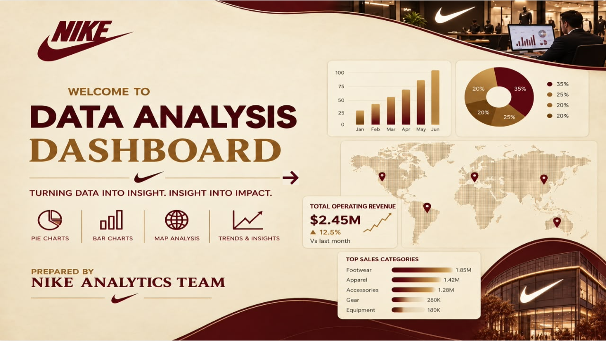

# Nike Sales Analytics Dashboard – Power BI

## 📊 Overview

From Raw Data to Business Insights

Does working with a large amount of data mean simply creating charts? Absolutely not.

The real challenge was organizing the data, building a suitable data model, and transforming raw data into a clear business analysis that helps understand sales performance.

In this project, I developed a Nike Sales Analytics Dashboard using Microsoft Power BI, starting with data preparation and transformation using Power Query, followed by building a structured Star Schema data model connecting Fact and Dimension tables.

I then used DAX to create measures and calculate key business KPIs.

## 📈 Key KPIs

- Total Sales
- Total Profit
- Total Orders
- Total Quantity
- Profit Margin
- Average Order Value
- Discount
- Returned Orders

## 📑 Multi-Page Business Analysis

The dashboard is divided into multiple pages, with each page focusing on a different aspect of the business.

### 1. Overall Performance Analysis

Provides a comprehensive overview of sales, profit, orders, and overall business performance.

### 2. Product & Category Analysis

Analyzes Products, Categories, and Sub-Categories while monitoring Sales, Profit, and Discounts.

### 3. Customer Analysis

Analyzes customers and segments, including Sales, Customer Value, and Orders.

### 4. Geographic Performance Analysis

Compares business performance across Regions, States, and Cities, with analysis of Sales, Profit, and Orders.

### 5. Shipping Performance Analysis

Analyzes shipping methods, Orders, Quantity, Profit Margin, and Loss Orders.

## 🛠️ Tools & Techniques

- Power BI
- Power Query
- DAX
- Data Modeling
- Star Schema
- KPIs
- Slicers
- Filters
- Interactive Navigation

## 🎯 Project Objective

The goal was not simply to build a visually appealing dashboard, but to create a structured business analysis that helps identify patterns, understand performance, and transform raw data into clear and actionable insights.

## 🖥️ Dashboard Preview

## 🎥 Dashboard Demo

A video demonstration of the interactive dashboard is included in this repository.
